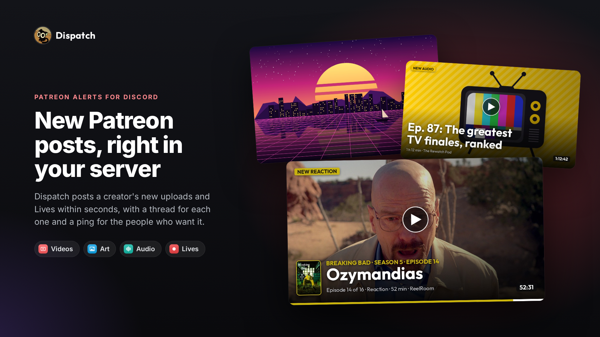
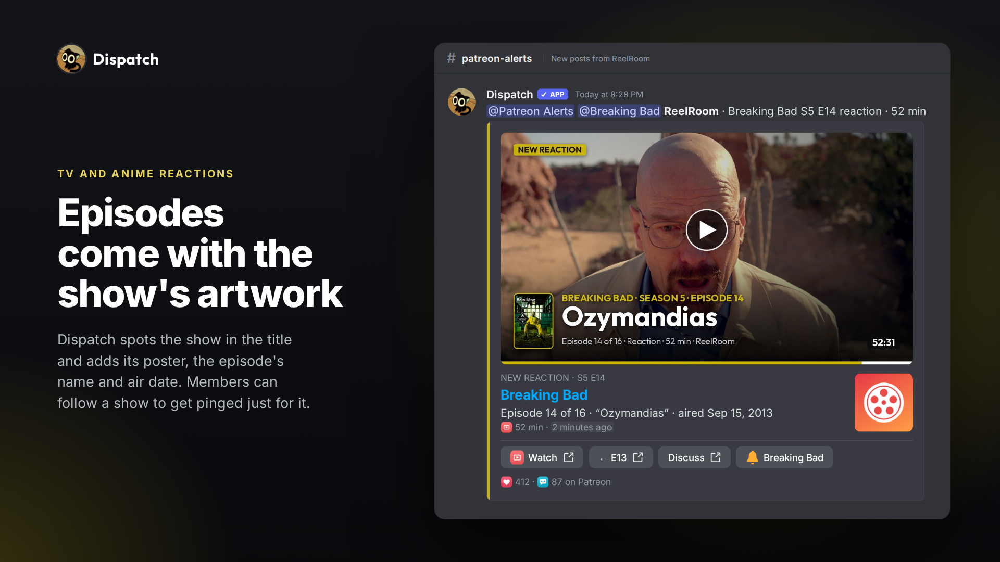
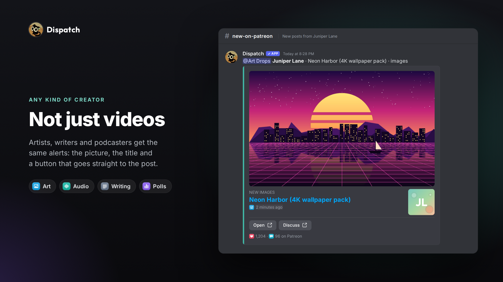
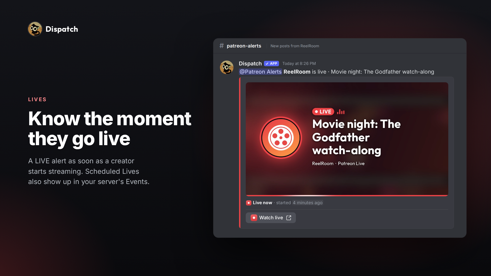
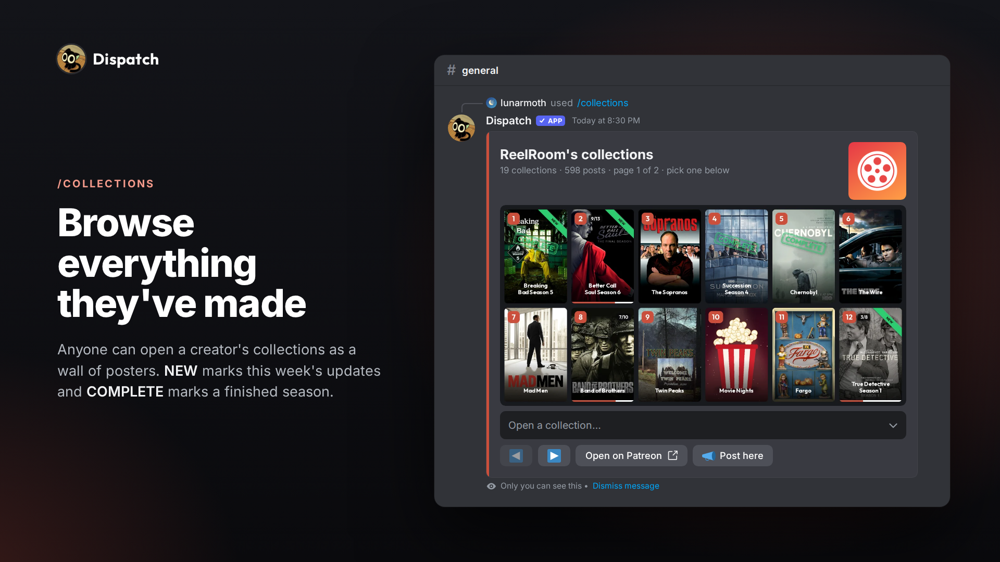
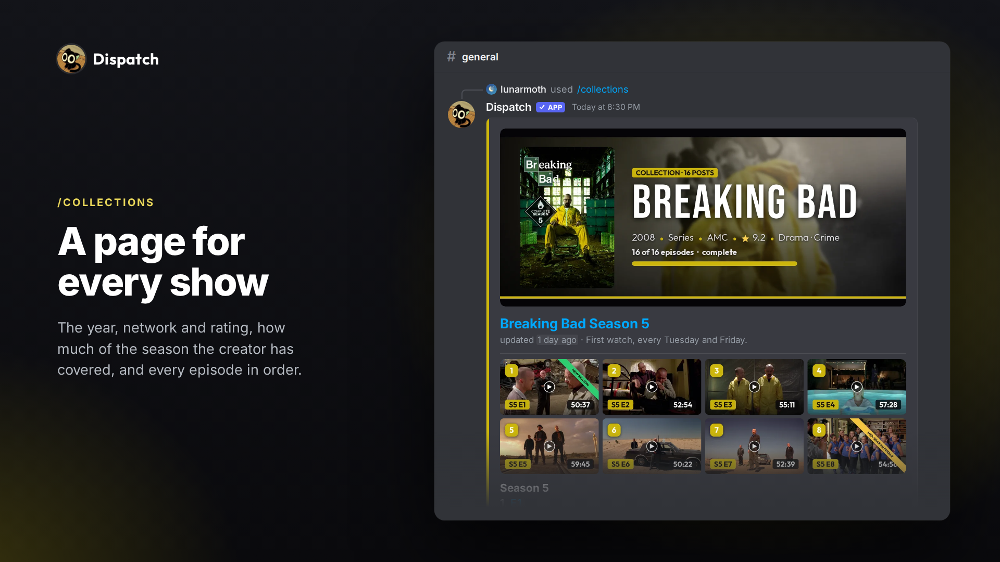
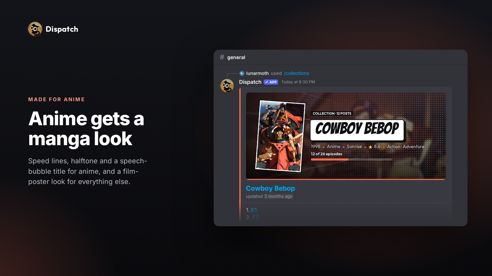
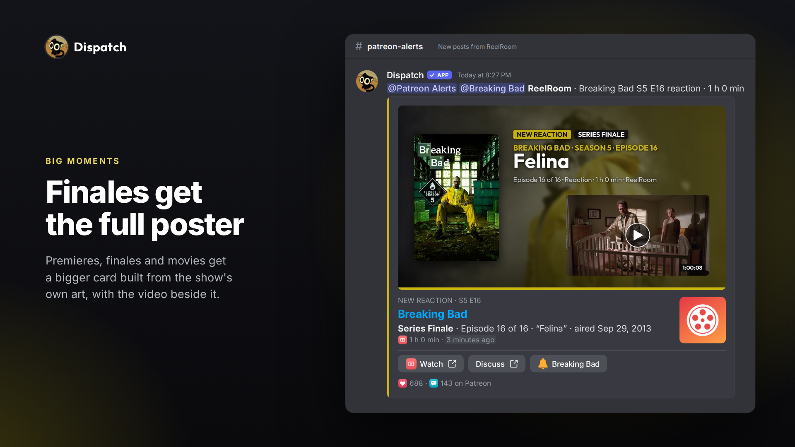
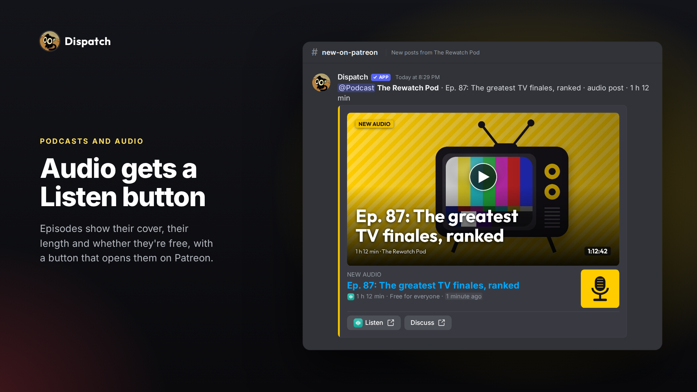

# Dispatch media

Screenshots for Dispatch's listing in Discord's App Directory. Dispatch posts new Patreon uploads and
Lives in Discord servers.

| | |
|---|---|
|  |  |
|  |  |
|  |  |
|  |  |
|  | |

The creators, posts, usernames and numbers in these screenshots are made up for the demo; the cards
themselves are drawn by Dispatch's own code. Show posters and episode stills come from TVmaze and
AniList, the same databases Dispatch uses, and belong to their owners.

Docs, terms and privacy: <https://locked.gitbook.io/dispatch>
